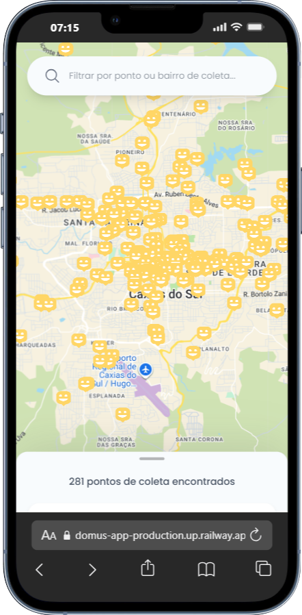

# Domus Maps

Este repositório contém o aplicativo Domus Maps — um mapa que mostra pontos de coleta e exibe detalhes em cards.

## Screenshots

<p align="center">
  
  
  
  
</p>

## Tecnologias

- Vue 3 w/ Nuxt UI & Tailwind
- TypeScript
- Vite
- APIs do Google Maps

## Rodar Projeto

Pré-requisitos: Node.js (>=20), pnpm (recomendado) ou npm/yarn.

1. Instalar dependências

```powershell
pnpm install
```

2. Rodar em modo de desenvolvimento

```powershell
pnpm dev
```

## Licença

Este projeto está licenciado sob a Licença GNU GENERAL PUBLIC LICENSE V3 — veja o arquivo [LICENSE](LICENSE) para os termos completos.