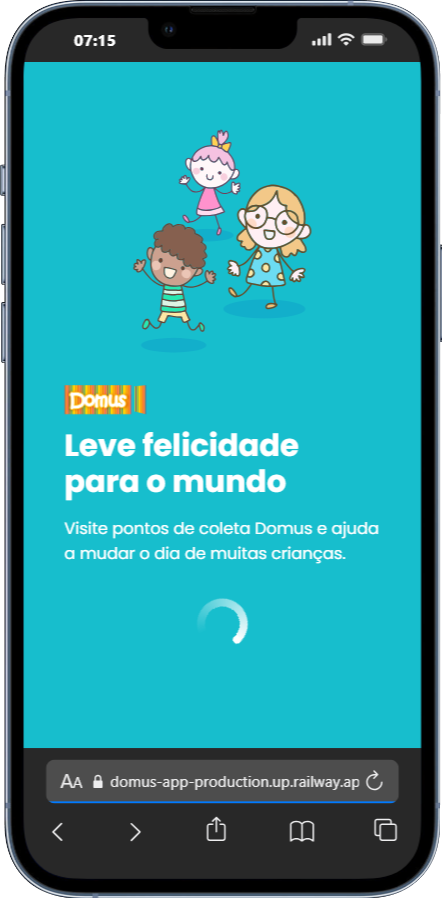
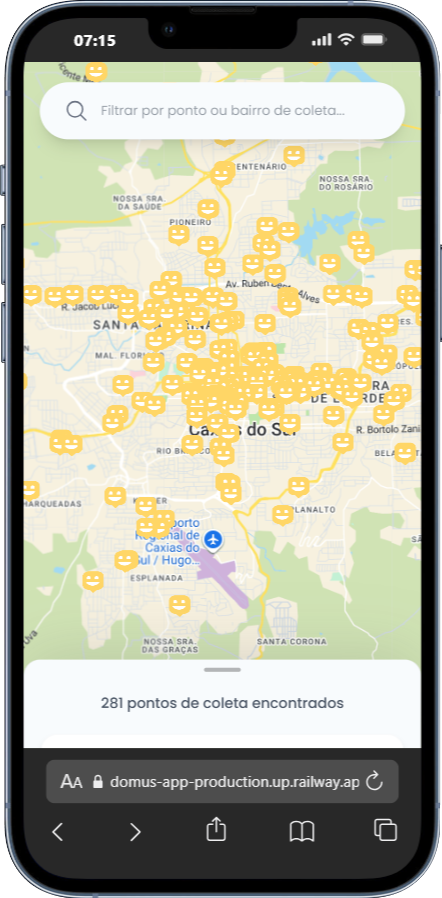
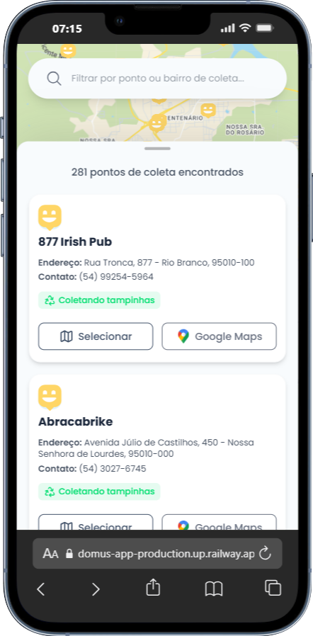
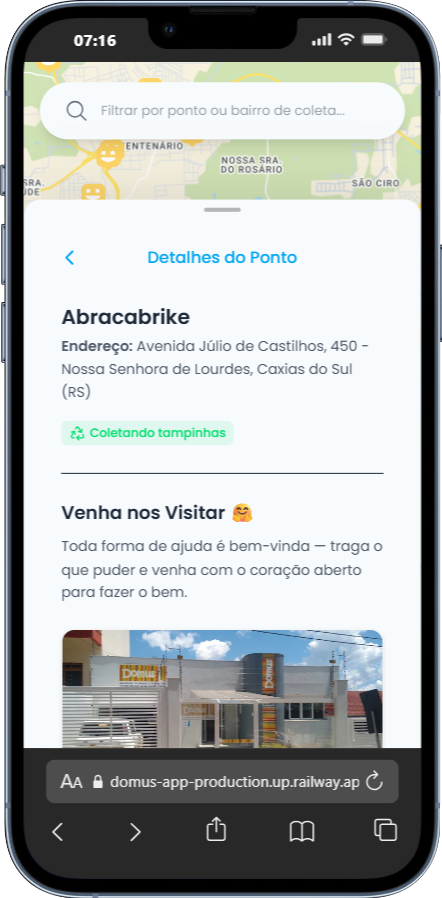

# Domus App

Aplicação front-end construída com Vue 3, TypeScript e Vite para localizar e visualizar pontos de coleta.

## Screenshots

<p align="center">
  
  
  
  
</p>

## Sobre

Este repositório contém a interface do Domus — um exemplo de app que mostra pontos de coleta no mapa e exibe detalhes em cartões responsivos. O projeto usa Single File Components (SFC) com `<script setup>` e foi configurado com Vite + TypeScript + Nuxt UI.

## Tecnologias

- Vue 3 w/ Nuxt UI & Tailwind
- TypeScript
- Vite
- APIs do Google Maps

## Como rodar localmente

Pré-requisitos: Node.js (>=20), pnpm (recomendado) ou npm/yarn.

1. Instalar dependências

```powershell
pnpm install
```

2. Rodar em modo de desenvolvimento

```powershell
pnpm dev
```
